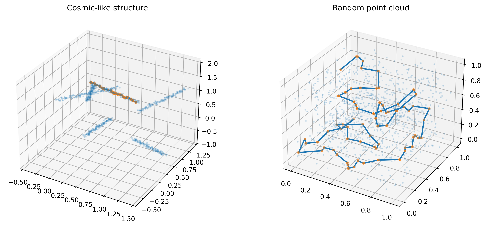
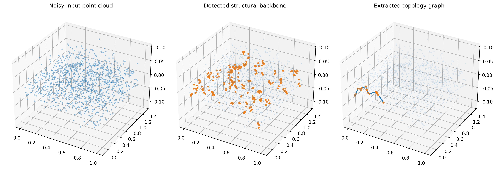
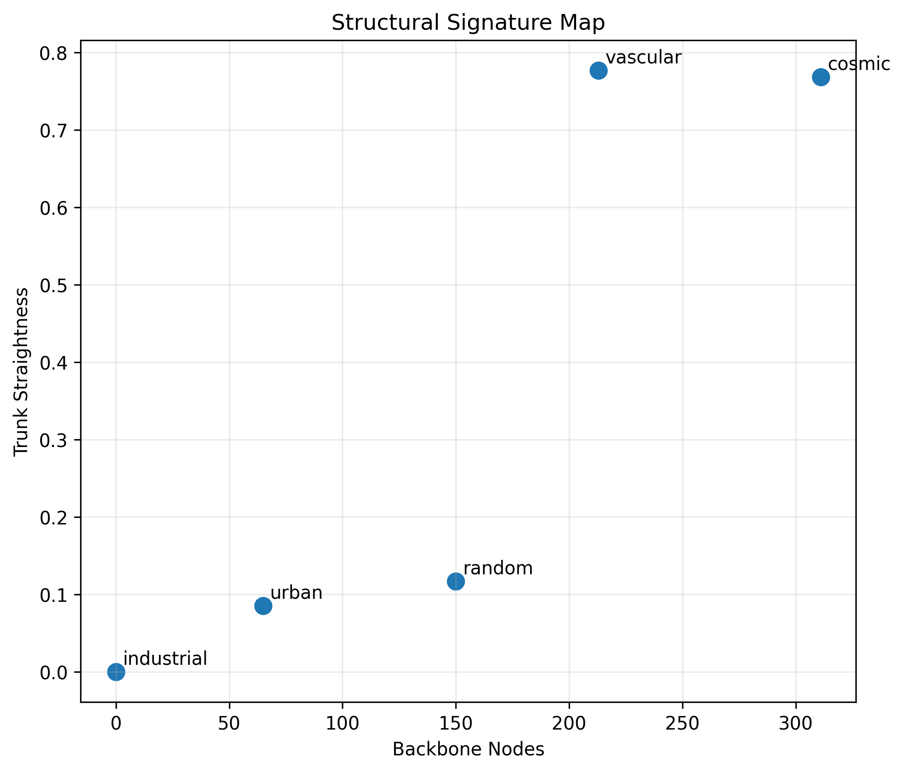

# Structural Network Engine

Domain-agnostic structural network extraction from spatial point clouds.

## Scientific paper

https://doi.org/10.5281/zenodo.18958193

## Live demo

https://adaptive-structural-network-detection-4.onrender.com/

This demo illustrates structural network extraction on spatial point clouds.

## Overview

Structural Network Engine is a computational framework designed to extract structural networks embedded in spatial point clouds.

The method reconstructs:

- filament structures
- backbone networks
- topology graphs
- trunk paths
- structural metrics

The framework is designed to be domain-agnostic and applicable across multiple fields.

Example domains include:

- cosmic web detection
- vascular network reconstruction
- infrastructure networks
- LiDAR derived urban structures
- industrial pipeline systems

## Example outputs

### Cosmic structure vs random distribution

### Pipeline / vascular structures

### Structural signature map

## Repository contents

This repository contains:

- scientific paper
- benchmark visualizations
- structural analysis examples

The proprietary core engine is not included in this repository.

## Citation

If you use this work, please cite:

Bili Toponi, N. (2026).  
Structural Network Engine: A Domain-Agnostic Framework for Structural Network Extraction from Spatial Point Clouds.  
Zenodo.  
https://doi.org/10.5281/zenodo.18958193
